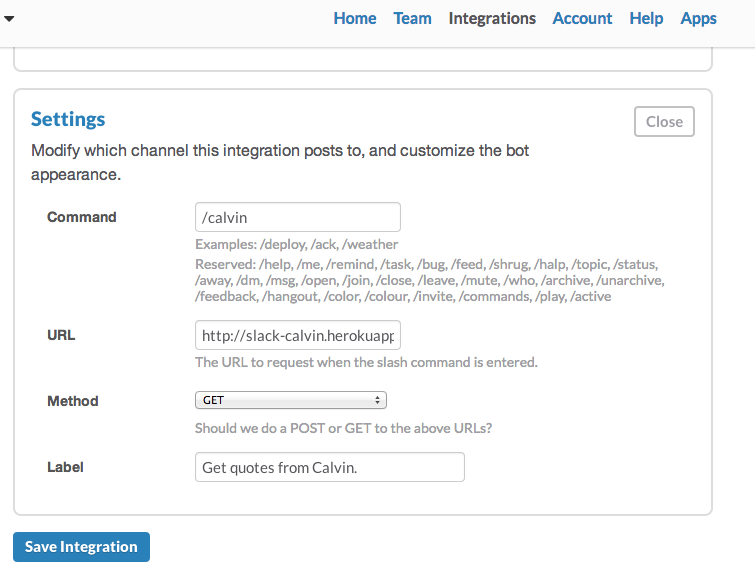
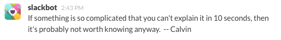
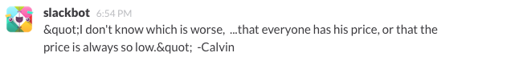

This provides an HTTP GET endpoint you can use to grab [Calvin quotes](http://iheartquotes.com/tags/calvin?page=1) for [Slack](http://slack.com).

## Setup

In Slack, once you are logged in, go to Integrations -> Add New Integration and click "Slash Commands". On the next screen, click "Add Slash Command".

Use these parameters in the Settings area:

* Command: `/calvin`
* URL: `http://slack-calvin.herokuapp.com` (or whereever you've deployed this)
* Method: GET
* Label: `Get quotes from Calvin`

It should look like this:



Click "Save Integration". Now in a channel on Slack, type `/calvin` and you should get a quote. 



I'm sure this will increase your productivity by 200% (no guarantees though). 

## Info

More info on the quotes API we use: http://iheartquotes.com/api

The reason for this code's existence is simply to decode html entities so quotes look right in Slack.  This is what I was seeing when just using the iheartquotes api directly:

```` 
&quot;I don't know which is worse,  ...that everyone has his price, or that 
      the price is always so low.&quot;  -Calvin 
````

And it looked like this when Slack slurped it up and spat it out:



There's probably an easier way to clean that up though (easier than creating a heroku project just to run `entities.decode`). Feel free to let me know (@techieshark on twitter) if you think of something. 

License: GPLv3
